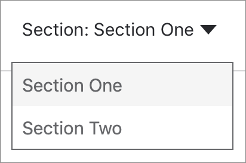

# Java Programs

You will find the **`Documentations`** of the code with _`proper`_ explanations. The **`Doumentation`** is ~~`lengthy`~~ so that the readers can have an ease of _`understanding of each concept`_.

With referance to the Docs of the previous programs, the Docs gets shorter and only the new concepts are explained.

The Docs will have the following features for ease of use and readability
- If Multiple ways of writing the same code is there then There will be a switch menu on top like this. Select the required Method from here.



- You will have codeblocks like these
```Python
print("😊 Welcome 😊");
```

- Any special code will be `highlighted`

- There will be
> **Warnings**
> 
> A Warning on what to be careful about
> 

{style="warning"}

> **Tips**
> 
> A Tip on how to code
> 

{style="tip"}

> **Note**
> 
> A Note about the code
> 

{style="note"}